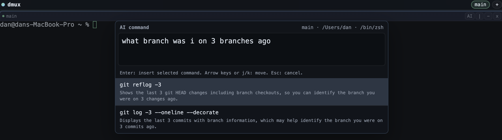

# dmux

`dmux` is a desktop terminal multiplexer with split panes, sessions, mouse resizing, Vim-style controls, and a pane-aware AI command assistant.



## Mac Setup

If you just want the app set up on a Mac, run this:

```bash
make build
```

On macOS, that installs dependencies if needed, builds `dmux.app`, and links it to `/Applications/dmux.app`.

## What It Does

- PTY-backed terminal panes
- Horizontal and vertical pane splits
- Mouse-draggable pane dividers
- Vim-style focus movement with `h/j/k/l`
- Vim-style pane resizing with `H/J/K/L`
- Multiple sessions
- Inline pane renaming
- Auto-close panes when their shell exits
- Packaged macOS app output via `electron-builder`
- AI command suggestions scoped to the focused pane's shell, cwd, name, and recent output

## Stack

- [Electron](https://www.electronjs.org/)
- [xterm.js](https://xtermjs.org/)
- [node-pty](https://github.com/microsoft/node-pty)
- [electron-builder](https://www.electron.build/)

## Requirements

- macOS is the primary tested target right now
- Node.js 22+
- `zsh` or another supported shell available locally

## Quick Start

```bash
git clone https://github.com/your-name/dmux.git
cd dmux
npm install
cp .env.example .env
```

Set your OpenAI key in `.env`:

```env
DMUX_AI_PROVIDER=openai
OPENAI_API_KEY=your_openai_api_key_here
# Optional:
# DMUX_OPENAI_MODEL=gpt-4.1-mini
```

Or use Anthropic instead:

```env
DMUX_AI_PROVIDER=anthropic
ANTHROPIC_API_KEY=your_anthropic_api_key_here
# Optional:
# DMUX_ANTHROPIC_MODEL=claude-3-5-sonnet-latest
```

Then start the app:

```bash
npm start
```

## Keyboard Model

`dmux` uses a tmux-style prefix for pane/session control, plus a direct AI shortcut.

### Prefix Commands

Press `Ctrl-b`, then:

| Shortcut | Action |
| --- | --- |
| `|` | Split vertically |
| `-` | Split horizontally |
| `h/j/k/l` | Move focus |
| `H/J/K/L` | Resize focused pane |
| `x` | Close focused pane |
| `c` | New session |
| `n` | Next session |
| `p` | Previous session |

### AI Command Assistant

Press `Ctrl-a` to open the AI prompt for the focused pane.

Flow:

1. Describe what you want in plain English.
2. Press `Enter` to generate suggestions.
3. Use `ArrowUp` / `ArrowDown` or `j` / `k` to select one.
4. Press `Enter` again to insert the command into the active prompt.

The command is inserted, not executed.

Press `Esc` to cancel.

## Mouse Interaction

- Drag pane dividers to resize
- Click a pane to focus it
- Click a pane title to rename it

## Packaging

Build a macOS app bundle:

```bash
npm run pack
```

That produces:

```bash
dist/mac-arm64/dmux.app
```

If you want to symlink it into Applications for development:

```bash
ln -sfn /absolute/path/to/dmux/dist/mac-arm64/dmux.app /Applications/dmux.app
```

Or use the helper script:

```bash
./scripts/setup-mac.sh
```

## Project Layout

```text
src/
  main.js              Electron main process, PTY management, AI IPC
  preload.js           Secure renderer bridge
  renderer/
    index.html         App shell
    app.js             Layout, shortcuts, sessions, AI overlay
    styles.css         Dense UI styling
```

## AI Behavior

The AI command assistant currently:

- uses the focused pane only
- includes pane name, shell, cwd, and recent terminal output as context
- returns command suggestions plus short explanations
- inserts a selected command into the shell prompt without auto-running it

Current implementation note:

- it supports `openai` or `anthropic` via `.env`
- OAuth is not implemented

## Current Limitations

- macOS-first packaging path
- no full `tmux` config compatibility
- no detached background daemon
- no persistent sessions across full app restarts
- no remote multiplexing
- AI suggestions are only as good as the current pane context and prompt

## Roadmap Ideas

- persistent sessions across restarts
- richer session management UI
- command history per pane
- safer backend-mediated AI auth
- better packaging assets and app icon
- Linux packaging

## Development Notes

- `.env` is loaded by the main process at startup
- `.env`, `node_modules/`, and `dist/` are gitignored
- `node --check` is a quick syntax sanity check for the JS entrypoints

## License

[MIT](./LICENSE)
